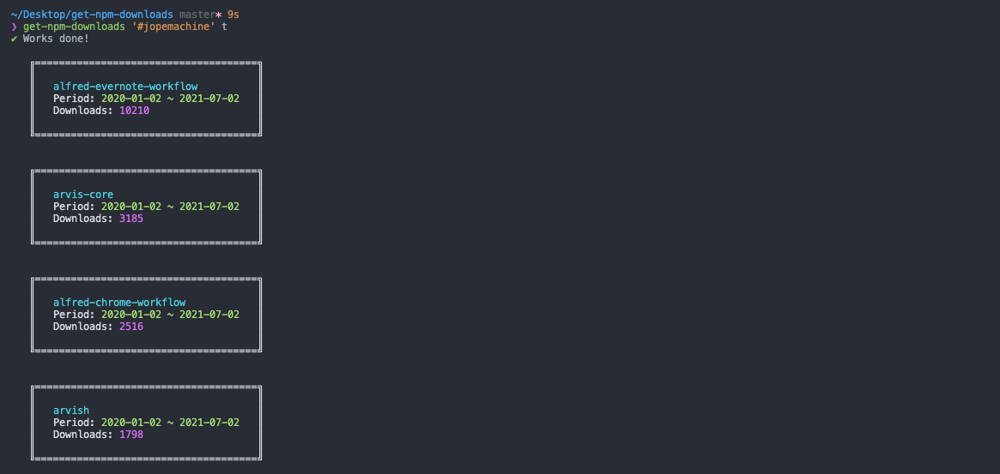

## get-npm-downloads [](https://www.npmjs.com/package/get-npm-downloads)

Display npm download in console (also include lib)

Using worker_threads to boost fetch speed.



### Usage

```js
const getNpmDownloads = require('get-npm-downloads');

const datas = getNpmDownloads({
  userId,
  repo,
  period: 'total'
});
```

### Usage-cli

```
  Usage
      $ get-npm-downloads [repository_name || #user_name] period_option

  Examples
      $ get-npm-downloads repository_name today
      $ get-npm-downloads repository_name last-day
      $ get-npm-downloads repository_name day
      $ get-npm-downloads repository_name last-week
      $ get-npm-downloads '#user_name' w
      $ get-npm-downloads '#user_name' last-month
      $ get-npm-downloads '#user_name' 2014-01-01:2014-01-31
      $ get-npm-downloads '#user_name' w
      $ get-npm-downloads '#user_name' t
```
